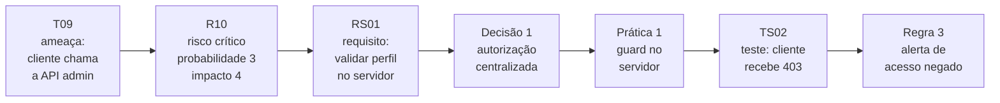

  

# Comer-Tchê!

Sistema de delivery construído como estudo de caso da disciplina de **Engenharia de Software Seguro** da UNIPAMPA.

O projeto tem uma característica que o define: **a segurança foi decidida antes de existir código**. Primeiro veio a modelagem de ameaças, depois a análise de riscos, os requisitos e as decisões de arquitetura. Só então a implementação, aplicando uma decisão por vez.

## O vídeo

Uma apresentação de 11 minutos percorrendo as sete etapas, da modelagem de ameaças ao pipeline em execução, com os arquivos abertos na tela.

  

| Momento | Assunto |
| ------- | ------- |
| [00:00](https://www.youtube.com/watch?v=bVAY5JtyTDI&t=0s) | Visão geral do sistema |
| [00:58](https://www.youtube.com/watch?v=bVAY5JtyTDI&t=58s) | Ameaças STRIDE e casos de abuso |
| [02:44](https://www.youtube.com/watch?v=bVAY5JtyTDI&t=164s) | Riscos e tratamento com o NIST CSF 2.0 |
| [04:05](https://www.youtube.com/watch?v=bVAY5JtyTDI&t=245s) | Requisitos e arquitetura segura |
| [06:14](https://www.youtube.com/watch?v=bVAY5JtyTDI&t=374s) | Código seguro e varredura com OWASP ZAP |
| [07:53](https://www.youtube.com/watch?v=bVAY5JtyTDI&t=473s) | Detecção de intrusões |
| [09:02](https://www.youtube.com/watch?v=bVAY5JtyTDI&t=542s) | Pipeline DevSecOps e o sistema implementado |

O roteiro do vídeo está versionado em [`roteiros/etapa-7-video-final.md`](https://github.com/comer-tche/software-seguro/blob/main/roteiros/etapa-7-video-final.md), com a divisão por integrante e os arquivos mostrados em cada trecho.

## Os dois repositórios

| Repositório | O que tem dentro |
| ----------- | ---------------- |
| **[software-seguro](https://github.com/comer-tche/software-seguro)** | A análise completa: modelagem de ameaças com STRIDE, registro e priorização de riscos com o NIST CSF 2.0, requisitos de segurança, decisões de arquitetura, práticas de código seguro, verificação com o OWASP ZAP, regras de detecção de intrusões e o pipeline DevSecOps |
| **[comer-tche](https://github.com/comer-tche/comer-tche)** | A implementação em Next.js e TypeScript. O histórico de commits reproduz a ordem da análise: o primeiro commit é a base sem controles, e cada commit seguinte aplica um requisito citando a seção que o originou |

## Como uma ameaça vira código

O mesmo problema atravessa as sete etapas do trabalho e termina em uma linha de código e em um teste automatizado:

## O que o sistema faz

Cadastro e autenticação com quatro perfis, cardápio, fechamento de pedido, confirmação de pagamento pelo gateway e rotas administrativas. É o núcleo necessário para exercitar os controles de segurança levantados na análise.

## Integrantes

| Integrante | GitHub |
| ---------- | ------ |
| Lucas Corrêa Rodrigues | [@lucascrodriguess](https://github.com/lucascrodriguess) |
| Luis Felipe Calone Silveira | [@Luisxsxsx](https://github.com/Luisxsxsx) |
| Rafael da Silva Moral | [@Rafaleel](https://github.com/Rafaleel) |
| Cristhian Kapelinski | [@CristhianKapelinski](https://github.com/CristhianKapelinski) |
| Beatriz Machado | [@INARI18](https://github.com/INARI18) |

## Participação

**Os cinco integrantes contribuíram igualmente para o trabalho.** A colaboração aconteceu em várias frentes, e nem todas deixam commit:

- escrita das seções e do texto das etapas;
- revisão e correção do que os colegas escreveram, incluindo apontar erro de conteúdo e pedir reescrita;
- levantamento das ameaças e construção dos casos de abuso;
- discussão e decisão conjunta da pontuação, da priorização e da ordem de tratamento dos riscos;
- pesquisa nos catálogos de referência, CWE e OWASP, para embasar as decisões;
- criação, revisão e ajuste dos diagramas;
- execução da ferramenta de verificação e leitura conjunta do relatório;
- implementação dos controles e revisão do código;
- organização do repositório e da estrutura de arquivos;
- conferência do trabalho contra o enunciado e contra as aulas;
- reuniões de alinhamento e discussões em grupo ao longo de toda a disciplina;
- gravação, montagem e revisão do vídeo final.

Boa parte das decisões foi tomada em conjunto, em reunião, com uma pessoa ao teclado enquanto o grupo discutia. Por isso o histórico de commits mostra quem registrou a alteração, e não sozinho quem participou de produzi-la.

## Aviso

Este é um artefato acadêmico. O primeiro commit da implementação é **deliberadamente inseguro**, para servir de ponto de partida à aplicação dos controles, e os trechos vulneráveis estão marcados no código. Nada aqui deve ser publicado na internet nem usado com dados reais de pessoas.
